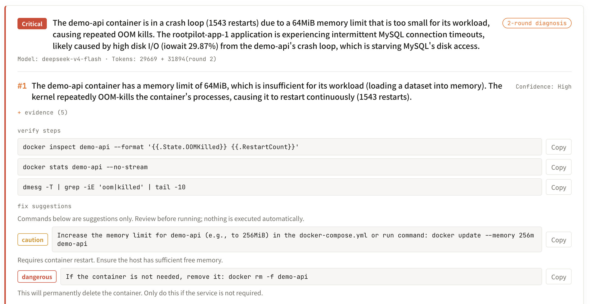

<div align="center">


# RootPilot

### Monitoring tells you something broke. RootPilot tells you why.

AI root-cause analysis for your Docker servers — self-hosted, read-only, bring-your-own-key.

[](LICENSE.md)
[](CHANGELOG.md)


</div>

---

<div align="center">
  
</div>

## How it works

Your alerts already tell you *what* broke. RootPilot connects to the affected host, gathers evidence with a fixed read-only command set, and hands you a root-cause report — cause, the evidence chain behind it, and the exact commands to fix it.

```
   ┌────────────┐      ┌────────────────────┐      ┌──────────────────────┐
   │  Connect   │ ───▶ │  Collect (read-only│ ───▶ │  Root-cause report   │
   │  via SSH   │      │  whitelist)        │      │  cause · evidence ·  │
   └────────────┘      └────────────────────┘      │  suggested commands  │
                                                    └──────────────────────┘
```

No agent to install on your servers. Just SSH.

## Security model

- **Self-hosted, data never leaves.** You run the container; diagnoses happen between your box and your hosts. No RootPilot cloud in the path, no telemetry.
- **Bring your own key (BYOK).** Use your own LLM API key. Your logs and prompts go to the model *you* choose.
- **Fixed read-only whitelist.** RootPilot can only run a fixed set of read-only inspection commands over SSH — never a write, never an arbitrary command. A few of them:

  | command | what it inspects |
  |---|---|
  | `docker ps -a` | container status / restarts |
  | `df -h` · `df -i` | disk and inode usage |
  | `free -m` | memory and swap |
  | `dmesg … oom` | kernel OOM kills |
  | `docker logs --tail 500` | recent container logs |
  | `container_state` | exit code / OOMKilled / restart count |
  | `ss -tan … uniq -c` | connection-state floods |
  | `iostat -xz` · `vmstat` | IO / CPU saturation |
  | `journalctl -n 200` | recent system journal |
  | `lsof +L1` | deleted-but-open files (phantom disk usage) |

  The full **38-command whitelist** is in [docs/security.md](docs/security.md) — every command, verbatim.
- **Encrypted credentials.** Stored SSH credentials are encrypted at rest with AES-256-GCM using a key that stays on your machine.

## Tested, not vibes

RootPilot is calibrated against a library of real, injected failure scenarios — not hand-picked demos.

> **38 read-only commands · 89.7% root-cause accuracy across 29 standard failure scenarios · zero false alarms on healthy hosts.**

Scenarios span disk-full (including deleted-but-open files), inode exhaustion, OOM kills, container crash loops, IO saturation, TIME_WAIT floods, DNS failure, clock drift, fd exhaustion and more. The calibration scenario library is being open-sourced so you can see — and challenge — exactly what "tested" means. *(link coming: the collection/calibration layer is already open source — see [Related](#related).)*

## Quick start

Requirements: **Docker 20.10+** and **Docker Compose v2** (`docker compose`). ~2 GB free memory.

```bash
# 1. get the compose + env template
curl -fsSLO https://raw.githubusercontent.com/Easton-OU/rootpilot-release/main/docker-compose.yml
curl -fsSLO https://raw.githubusercontent.com/Easton-OU/rootpilot-release/main/.env.example
cp .env.example .env

# 2. set a DB password and an encryption key in .env
#    DB_PASSWORD=$(openssl rand -hex 16)
#    ROOTPILOT_ENCRYPT_KEY=$(openssl rand -base64 32)

# 3. start it
docker compose up -d
```

Then open **http://localhost:18081**. The console binds to loopback only — if the host is remote, tunnel in:

```bash
ssh -L 18081:localhost:18081 user@your-server   # then open http://localhost:18081 locally
```

Full guide, including one-command install and jump-host setups: [docs/deployment.md](docs/deployment.md).

## Editions

| | Free | Pro | Max |
|---|---|---|---|
| Hosts | 1 | 2–10 | more |
| Root-cause diagnosis | ✓ | ✓ | ✓ |
| Alert-triggered auto-diagnosis | ✓ | ✓ | ✓ |
| History ("medical record") | ✓ | ✓ | ✓ |
| Price | free | $12/mo · $99/yr | see site |

Founding-user pricing may differ — current offers are on [rootpilotx.com](https://rootpilotx.com).

## FAQ

**Where does my data go?** Nowhere but between your RootPilot container and your own hosts (SSH) and the LLM API key you provide. No RootPilot-hosted middleman, no telemetry.

**Which models are supported?** Bring your own key. RootPilot works with mainstream LLM APIs; you choose the provider and model.

**How does this relate to Prometheus / Grafana?** They tell you a metric crossed a line. RootPilot picks up from there — it explains *why*, and it can read your Prometheus for trend context during a diagnosis. It complements monitoring, it doesn't replace it.

More in [docs/faq.md](docs/faq.md).

## Feedback

Issues welcome. And if RootPilot fails on your weirdest failure, open an issue with the logs — it becomes a calibration case, and the accuracy number above goes up because of you.

## Related

- **[rootpilot-mcp](https://github.com/Easton-OU/rootpilot-mcp)** — the read-only SSH collection layer as an open-source (MIT) MCP server. Bring your own LLM in Claude Desktop or any MCP client.

## License

RootPilot itself is closed-source commercial software. **This repository** — documentation and deployment configuration — is MIT ([LICENSE.md](LICENSE.md)). The container image is provided for use under the product's terms.
